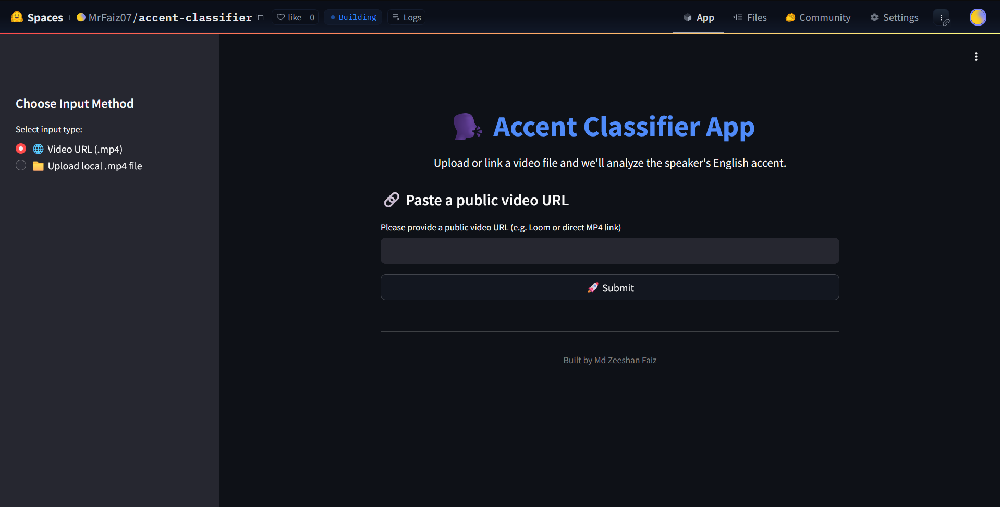

# 🎯 Accent Classifier App

The **Accent Classifier App** is a simple and powerful tool that helps you identify the English accent of a speaker from any `.mp4` video file. 



Just upload a video or paste a public link, and the app will:

- 🎧 Extract the audio
- 🗣️ Detect whether the speaker is using English
- 🌍 Classify the English accent (e.g., Indian, British, American, Australian, etc)
- 📊 Provide a confidence score (0–100%)
- 📝 Generate a short summary of what was said

It's designed for quick analysis and works well even with basic videos perfect for demos, interviews, or screening tasks.

## 🛠️ How It Works – Pipeline & Logic

Our app follows a step-by-step pipeline to process the video and classify the speaker’s accent:

---

### 1️⃣ Video Input

- You can either **upload a local `.mp4` video file** or **paste a public video URL** (e.g., Dropbox).
- The video should have clear audio where one person is speaking in English.

---

### 2️⃣ Audio Extraction

- We use **MoviePy** to extract the audio from the video.
- The audio is saved in WAV format with mono channel and 16kHz sample rate, ideal for speech processing.

---
### 3️⃣ Transcription & English Detection

- We use **OpenAI's Whisper** model to convert speech into text.
- To ensure the transcript is in **English**, we use the `langdetect` library to detect the language of the transcribed text.
- If the language is not English, the classification is skipped to avoid incorrect results.

---

### 4️⃣ Accent Classification

- We use a **pre-trained ECAPA-TDNN model** from **SpeechBrain** to extract voice embeddings.
- These embeddings are compared against **reference samples** for known accents (e.g., Indian, British, American, Australian, Nigerian, Canadian).
- The app returns:
  - The **predicted accent**
  - A **confidence score** based on cosine similarity

---

### 5️⃣ Transcript Summary

- A short summary is generated from the transcript using the **Sumy** library with **LSA (Latent Semantic Analysis)** summarization.
- This extracts the top 3 most meaningful sentences, providing a quick glimpse into the speaker's content.

---

This modular pipeline makes the system easy to test, debug, or expand in the future (e.g., more accents, multilingual support).

## 🧪 Testing the App

You can test the Accent Classifier app in two simple ways:

### 1️⃣ Using a Local `.mp4` File
- Download any `.mp4` video file to your system.
- Use the file path (e.g., `C:/Users/yourname/Downloads/sample_video.mp4`) as input in the app.

### 2️⃣ Using a Public `.mp4` Link
- Paste a **direct** downloadable `.mp4` link from platforms like Dropbox or Google Drive.
- Make sure the URL ends in `.mp4` and supports direct streaming access.

✅ **Example public video link for testing:**

https://dl.dropboxusercontent.com/scl/fi/pguvqzl491zaudobageip/test_video.mp4?rlkey=5en49rvzm8vqnwuudiwydct9w&st=bac7tejx

> ⚠️ **Note:** Loom links currently **do not** provide a direct `.mp4` file link. In such cases, it’s recommended to download the Loom video manually and use the local file path instead.

### ⏳ Processing Time Notice

- The app downloads and processes the video before providing results.
- Processing time depends on the video duration and your internet speed.
- Please be patient while the model works in the background.

## 🚀 Run the App

You can try the Accent Classifier in two ways:

### 1️⃣ Clone and Run Locally

```bash
git clone https://github.com/Zeeshan-Faiz/AccentClassifier.git
cd AccentClassifier
pip install -r requirements.txt
streamlit run streamlit_app.py
```
This is the recommended method for best performance, especially on longer videos.

### 2️⃣ Try Online (Hugging Face Spaces)
You can also test the app online using our Hugging Face Spaces deployment:
👉 [Accent Classifier on Hugging Face Spaces](https://huggingface.co/spaces/MrFaiz07/accent-classifier)

> ⚠️ **Note:** Hugging Face Spaces has limited memory and compute power, which may affect performance or load times for longer videos.
